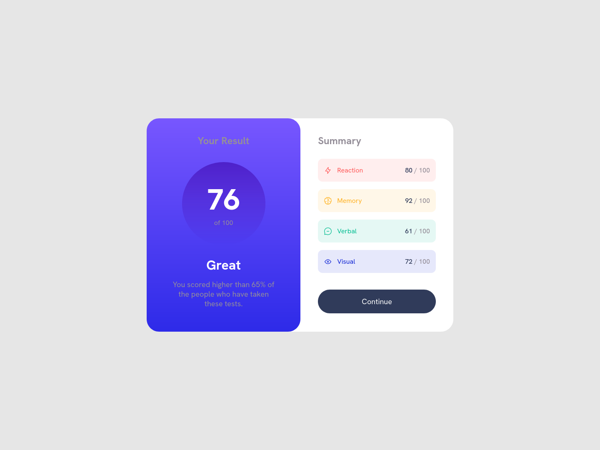

# Frontend Mentor - Results summary component solution

This is a solution to the [Results summary component challenge on Frontend Mentor](https://www.frontendmentor.io/challenges/results-summary-component-CE_K6s0maV). Frontend Mentor challenges help you improve your coding skills by building realistic projects.

## Table of contents

- [Overview](#overview)
  - [The challenge](#the-challenge)
  - [Screenshot](#screenshot)
  - [Links](#links)
- [My process](#my-process)
  - [Built with](#built-with)
  - [What I learned](#what-i-learned)
  - [Continued development](#continued-development)
- [Author](#author)

## Overview
This project display the result of an individual with the various stats that contribute to his score.

### The challenge

Users should be able to:

- View the optimal layout for the interface depending on their device's screen size
- See hover and focus states for all interactive elements on the page

### Screenshot

### Links

- Solution URL: [solution URL](https://github.com/abdullahmuslim/result-summary)
- Live Site URL: [live site](https://abdullahmuslim.github.io/result-summary)

## My process
- I took a close look at the [mobile](design/mobile-design.jpg) and [desktop](design/desktop-design.jpg) design.
- Complete the markup in the most efficient way for ease of transition.
- Add a single CSS breakpoint with styling that fit well on all display.
- dynamically add summary stats with Javascript from [data.json](data.json).

### Built with

- Semantic HTML5 markup
- CSS custom properties
- Flexbox
- Mobile-first workflow

### What I learned
During the development of the project I discover a linux app that I can use to measure pixels in image, making determination of spacing easier.

### Continued development
I'm getting used to presumming expected time of completion.
I missed my extimated time for completion, I will try to make it in the next project.

## Author

- Website - [Abdullah Muslim](https://abdullahmuslim.github.io/portfolio)
- Frontend Mentor - [@abdullahmuslim](https://www.frontendmentor.io/profile/abdullahmuslim)